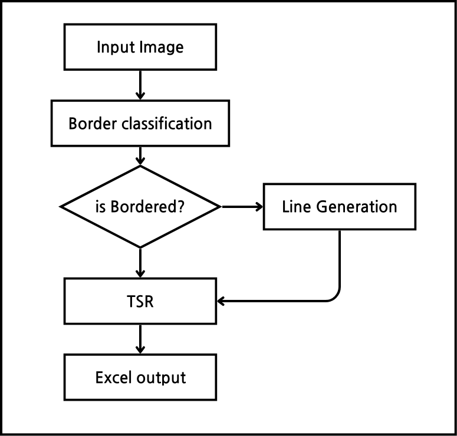
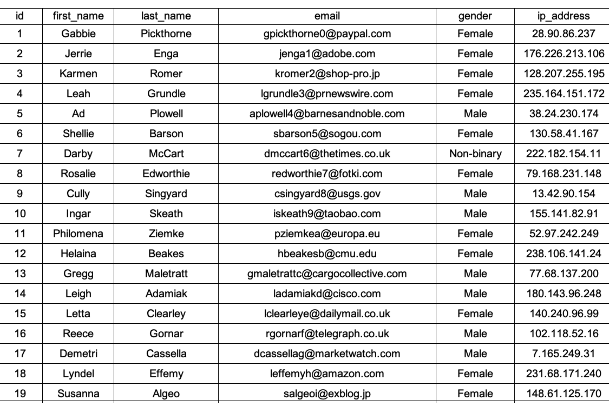
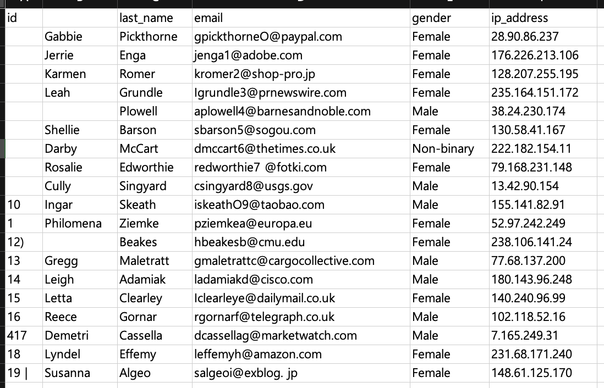

# Jump-up
# 국립한밭대학교 컴퓨터공학과 DfX팀

**팀 구성**
- 30211058 조지훈
- 20202689 오민석
- 20217137 송찬호

## Project Background
- 필요성
  - 디지털 전환으로 인해 문서에서 정보에 접근할 필요성이 증가.
  - 스캔 문서의 데이터를 디지털 문서로 변환하는 것이 필요.
  - 디지털 문서로 변환함으로써 업무의 자동화 및 생산성의 증가
  - 문자 인식 기술(OCR)을 활용하여 문서 내 문자를 일식할 수 있지만 한계점이 존재
  - 표 영역의 경우, 표 내부의 문자를 인식하는 것에만 국한됨.

- 기존 방식의 한계 및 문제점
  - 기존 방식의 딥 러닝 기반 표 구조 인식은 표 내부의 경계선이 있을 때 높은 추론 성능을 보임.
  - 이미지 처리 기반의 표 구조 인식은 경계선이 있는 종류(Bordered), 경계선이 부분적으로 있는 종류(Partially)의 종류를 수동으로 지정해 주어야 하는 한계점 존재.
  - 기존 방식으로 추론 된 데이터는 셀 병합 및 개행 시 다른 셀로 인식하는 문제점이 존재함.

## System Model
- 시스템 순서도

- 선 생성(Line Generator)
  - Vertical Line Generation(VLG)
    
  - Horizontal Line Generation(HLG)    
    

## Conclusion
표 이미지를 입력 해 최종적으로 엑셀로 변환하는 과정을 
- ### 입력 이미지
    
- ### 선 생성 결과
    
- ### 엑셀 출력 결과
    

